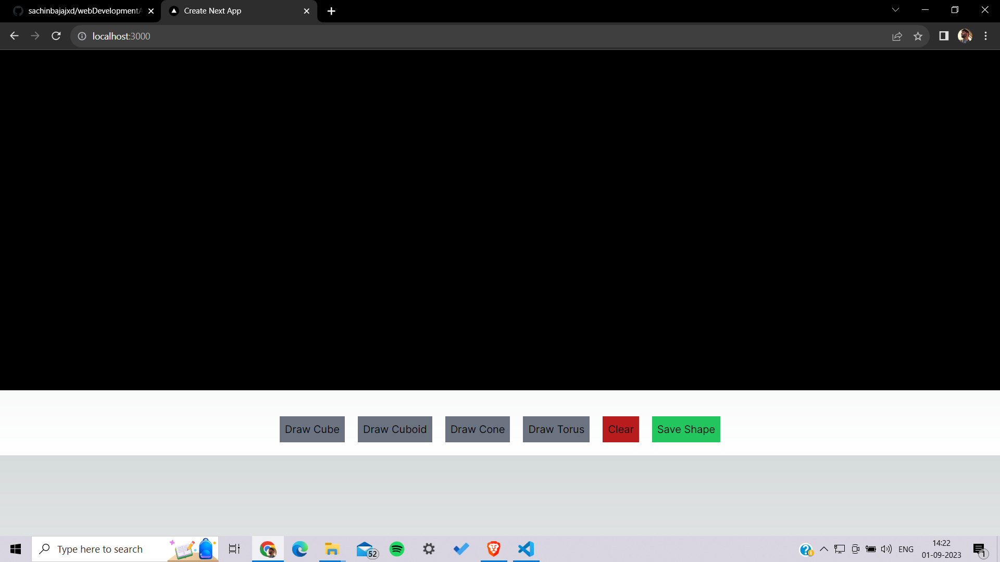
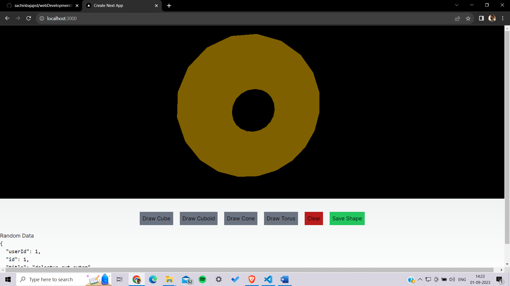

Assignment: Frontend Web Development Project

# How to run the project

1. Install all the dependencies using
 "**npm install**"

2. Run in development mode using
   "**npm run dev**"

# Home Page

# Shape

# Thought Process
In this project, I created a web application that allows users to draw shapes on a canvas using Three.js and save those shapes in local storage. Here's a brief overview of the thought process:

Canvas Creation: 
I started by creating an Canvas component canvas element that serves as the drawing area.

Three.js Integration: 
To render 3D shapes, I integrated Three.js into the project. I created functions to add different shapes like cubes, cuboids, cones, etc to the canvas.

Local Storage: 
I implemented a mechanism to store the shapes created by the user in the browser's local storage.

Styling with Tailwind CSS: 
I used Tailwind CSS to style the application, making it user-friendly and responsive.

# Difficulties Faced
During the development of this project, I encountered the challenge of learning Three.js, Working with Three.js. It took me sometime to understand the library and its various keywords.
